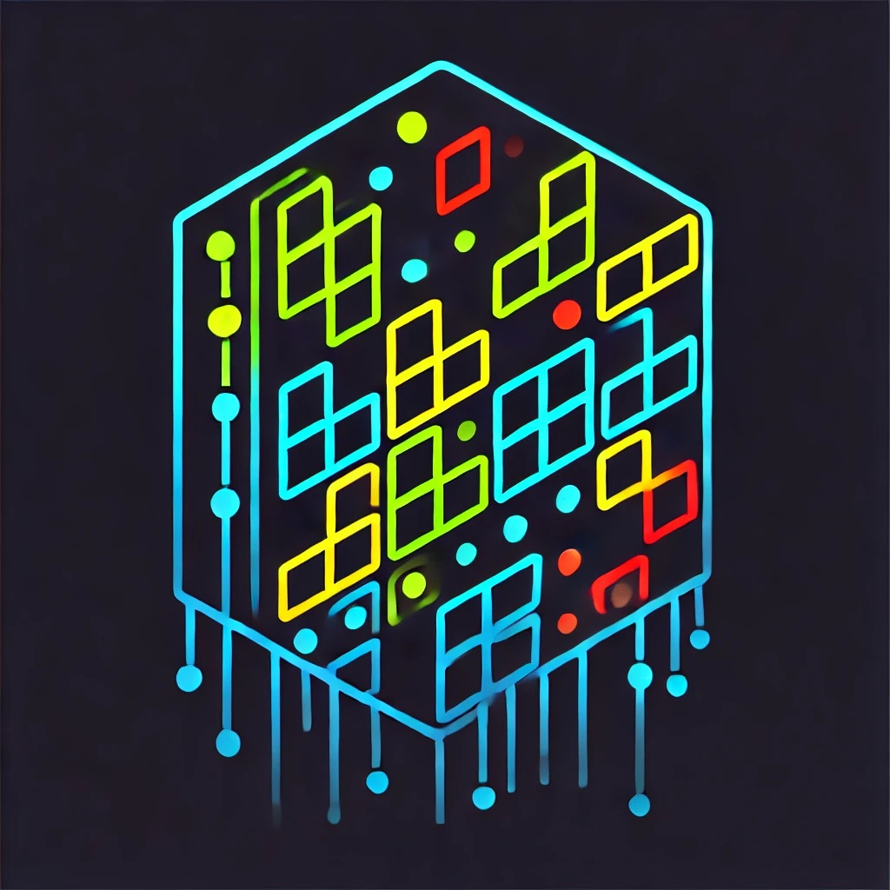

# The Whistleblowers' Tetris Autopilot!! 

### uOttahack 7 project for NAV Canada

## Overview
We were tasked to use AI to help the user make the best moves possible, while keeping the user responsible for the result of the game. 

## Different tasks
### Basic, human-controlled, tetris game
For this we used an online tutorial from Tech with Tim. This helped us understand the basic mechanics of pygame, all the while building a solid base for our future endeavours
### Machine Learning model to predict the best move, while also giving the user the ability to take over the game at any time
The artificial intelligence will learned based of of simulations of the game, receiving a reward for each line cleared and a penalty for each infavourable move made. This will help the AI learn the best moves possible, while also giving the user the ability to take over the game at any time with an constant opportunity to override
### Facial and glance recognition to ensure that the user is always supervising and paying attention to the gameplay
This will be done using a webcam and the OpenCV library. The AI will be able to detect when the user is not paying attention and will alert the user to come back to the game. If the user doesn't respond to the warnings, we will sound an alarm to be sure to capture his attention. The alarm and warnings will be disabled when the user comes back to the game.

